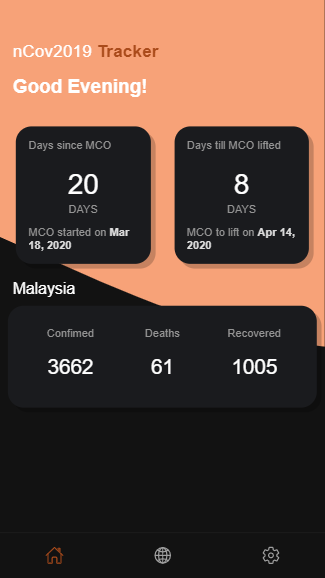

# nCov2019 Tracker

To provide user a clean-based looking to see the daily updates cases data in Malaysia.

## Features

* View each countries cases with daily update data
* Countdown status for Malaysia Movement Control period
* View status in line chart by [Chart.js](https://www.chartjs.org/)

## Screenshot

## Requirements

* [Android 8.0 (API 26)](https://developer.android.com/about/versions/oreo/android-8.0) and above

## Build

This application currently working on android environment (API 26).

### Android

1. 'npm install'
2. 'ionic cordova platform add android'
3. 'ionic cordova build android'
4. Connect your Android device and run the application with ionic cordova run android (make sure USB debugging is enabled on your device)

### IOS

1. 'npm install'
2. 'ionic cordova platform add ios'
3. 'ionic cordova build ios'
4. Connect your iOS device and run the application, either by
5. Opening up the relevant .xcodeproj on Xcode and clicking the run button (making sure your device is selected)
6. Running ionic cordova run ios --device on your CLI - this requires that the npm package ios-deploy is installed globally (npm install -g ios-deploy)

## Data Source API
Thanks to API data distributor for giving these data to success developed the application.

[Covid-19 Data in JSON](https://pomber.github.io/covid19/timeseries.json) by [Rodrigo Pombo's Github](https://github.com/pomber)